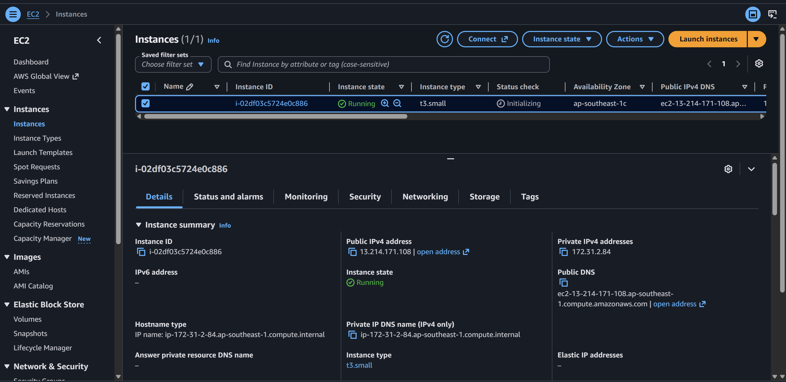

# Kubernetes EC2 Infrastructure Operator ☁️

## Overview

Kubernetes EC2 Automator is a Kubernetes Operator that creates, monitors, and deletes AWS EC2 instances through Kubernetes custom resources. It solves the problem of managing EC2 infrastructure separately from Kubernetes by providing a single declarative, Kubernetes-native workflow.
Users define the desired EC2 configuration in an EC2Instance resource, and the controller automatically reconciles it with AWS while reporting the instance status back to Kubernetes.

<br>

<ins> Tech Stack: Go, Kubernetes, Docker, Prometheus, Linux, AWS EC2 </ins>

<br>

## Infrastructure Architecture

```text
                         Developer
                             │
              kubectl apply -f ec2instance.yaml
                             │
                             ▼
                ┌──────────────────────┐
                │ Kubernetes API Server│
                │                      │
                │ • Validate CRD       │
                │ • Authentication/RBAC│
                └──────────┬───────────┘
                           │
                           ▼
                      ┌────────┐
                      │  etcd  │
                      │        │
                      │ spec   │
                      │ status │
                      └────┬───┘
                           │
                     Watch Event
                           │
                           ▼
        ┌──────────────────────────────────┐
        │      EC2Instance Controller      │
        │        Go + Kubebuilder          │
        │                                  │
        │       Reconciliation Loop        │
        │                                  │
        │  1. Read desired state           │
        │  2. Query actual AWS state       │
        │  3. Compare states               │
        │  4. Execute required action      │
        │  5. Update resource status       │
        └───────────────┬──────────────────┘
                        │
                   AWS SDK for Go
                        │
                        ▼
              ┌─────────────────────┐
              │      AWS EC2 API    │
              │                     │
              │ • RunInstances      │
              │ • DescribeInstances │
              │ • TerminateInstances│
              └──────────┬──────────┘
                         │
                         ▼
                  ┌─────────────┐
                  │EC2 Instances│
                  └──────┬──────┘
                         │
                   Actual State
                         │
                         ▼
              ┌────────────────────┐
              │ Status Sync        │
              │                    │
              │ instanceId         │
              │ state              │
              │ IP / conditions    │
              └─────────┬──────────┘
                        │
                        └──────────────► Kubernetes API


        ───────── Supporting Infrastructure ─────────

        Reliability                 Observability
        • Idempotency               • Prometheus
        • Finalizers                • Metrics
        • Retry / Backoff           • Logs
        • Error Handling            • Health Checks

                       Security
                    • Kubernetes RBAC
                    • AWS IAM

```

## Output



1. Developed a Go Kubernetes operator that provisions AWS EC2 instances and synchronizes their instance ID, health state, and network information into custom-resource status.


