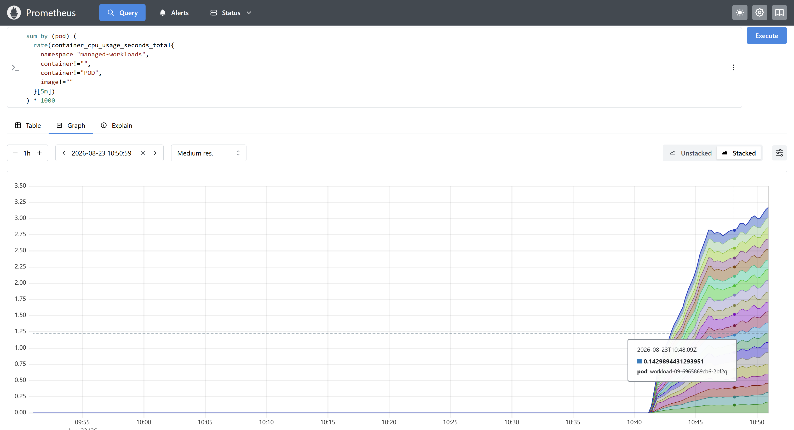
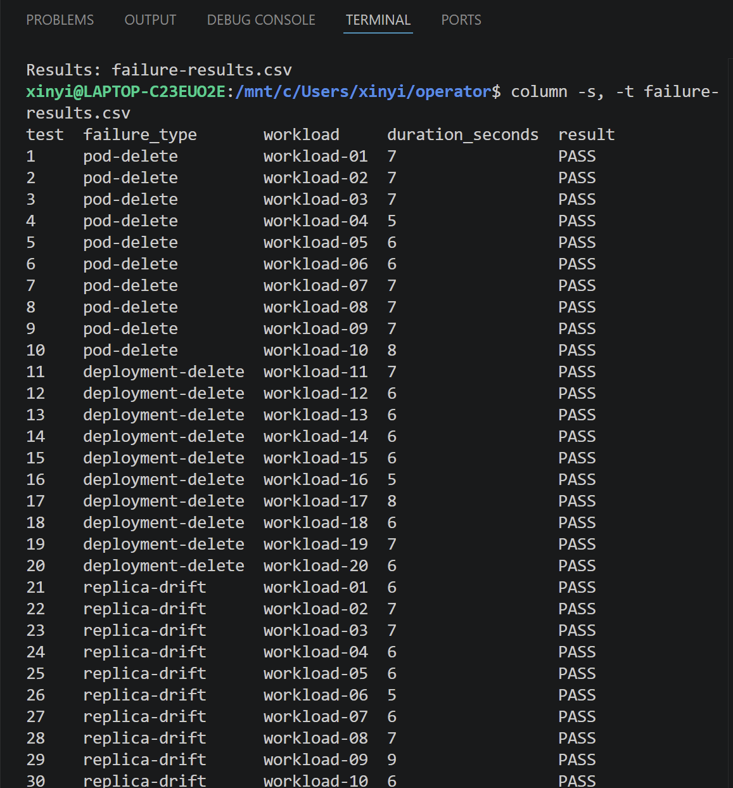

# Kubernetes EC2 Infrastructure Operator ☁️

## Overview

Kubernetes EC2 Automator is a Kubernetes infrastructure operator built with Go and Kubebuilder. It provides two custom resources:

- `EC2Instance` manages the creation, monitoring, and termination of AWS EC2 instances through the AWS SDK for Go.
- `ManagedWorkload` creates Kubernetes Deployments, monitors workload health, repairs replica drift, and recreates deleted resources.

The project also exposes Prometheus metrics and includes an automated failure-injection suite covering pod deletion, Deployment deletion, and replica drift.

<br>

<ins> Tech Stack: Go, Kubernetes, Docker, Prometheus, Linux, AWS EC2 </ins>

<br>

## Infrastructure Architecture

```text
                         Developer
                             │
              kubectl apply -f ec2instance.yaml
                             │
                             ▼
                ┌──────────────────────┐
                │ Kubernetes API Server│
                │                      │
                │ • Validate CRD       │
                │ • Authentication/RBAC│
                └──────────┬───────────┘
                           │
                           ▼
                      ┌────────┐
                      │  etcd  │
                      │        │
                      │ spec   │
                      │ status │
                      └────┬───┘
                           │
                     Watch Event
                           │
                           ▼
        ┌──────────────────────────────────┐
        │      EC2Instance Controller      │
        │        Go + Kubebuilder          │
        │                                  │
        │       Reconciliation Loop        │
        │                                  │
        │  1. Read desired state           │
        │  2. Query actual AWS state       │
        │  3. Compare states               │
        │  4. Execute required action      │
        │  5. Update resource status       │
        └───────────────┬──────────────────┘
                        │
                   AWS SDK for Go
                        │
                        ▼
              ┌─────────────────────┐
              │      AWS EC2 API    │
              │                     │
              │ • RunInstances      │
              │ • DescribeInstances │
              │ • TerminateInstances│
              └──────────┬──────────┘
                         │
                         ▼
                  ┌─────────────┐
                  │EC2 Instances│
                  └──────┬──────┘
                         │
                   Actual State
                         │
                         ▼
              ┌────────────────────┐
              │ Status Sync        │
              │                    │
              │ instanceId         │
              │ state              │
              │ IP / conditions    │
              └─────────┬──────────┘
                        │
                        └──────────────► Kubernetes API


        ───────── Supporting Infrastructure ─────────

        Reliability                 Observability
        • Idempotency               • Prometheus
        • Finalizers                • Metrics
        • Retry / Backoff           • Logs
        • Error Handling            • Health Checks

                       Security
                    • Kubernetes RBAC
                    • AWS IAM

```

## Results


The `EC2Instance` controller provisioned an EC2 instance and synchronized its instance ID, state, IP addresses, and DNS information into Kubernetes custom-resource status.

<br>



Prometheus collected container CPU metrics from 20 workloads distributed across a three-node Kubernetes cluster.

<!-- Add the memory screenshot here. -->

<br>



The automated failure-injection suite completed **30/30 recovery tests successfully**:

- 10 Pod-deletion scenarios
- 10 Deployment-deletion scenarios
- 10 replica-drift scenarios


